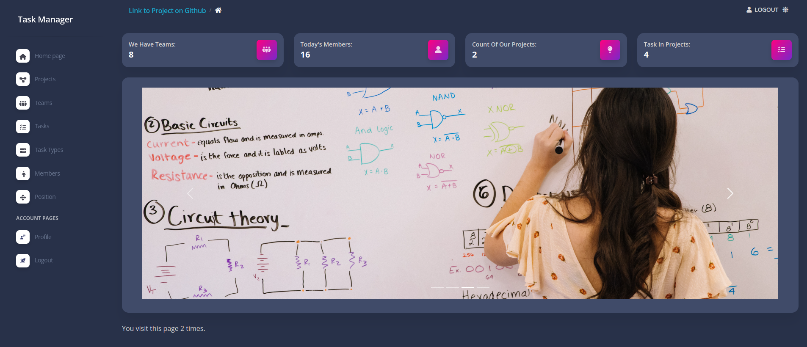
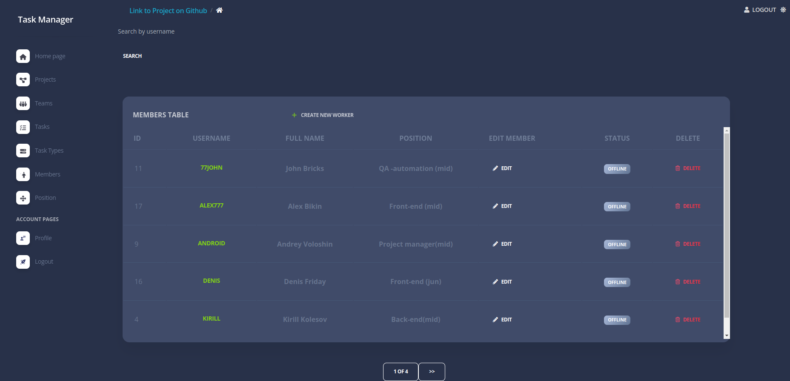

# it-company-task-manager

Django project to managing tasks adn workers in teams and projects


# Check it out!
[task-manager project deployed to Render](https://it-task-manager.onrender.com/)


## Installation
Python3 and Django must be already installed

```shell
git clone https://github.com/yevhenii-nevmyvako/it-company-task-manager
cd it-company-task-manager
python3 -m venv venv
source venv/bin/activate
pip install -r requirements.txt
python mnange.py runserver
```


## Features

* Authentication functionality for Worker/User
* Managing teams & tasks & project directly from website
* Powerful admin panel for advanced  managing
* Worker can take tasks and join a team
* On projects members can work on team and complete the task
* Worker can change position
* Tasks can change deadline & completedC & priority

## User for login 
* Url: http://127.0.0.1:8000/task_manager
* User: testuser
* Password: qaz1qaz1

## Demo


